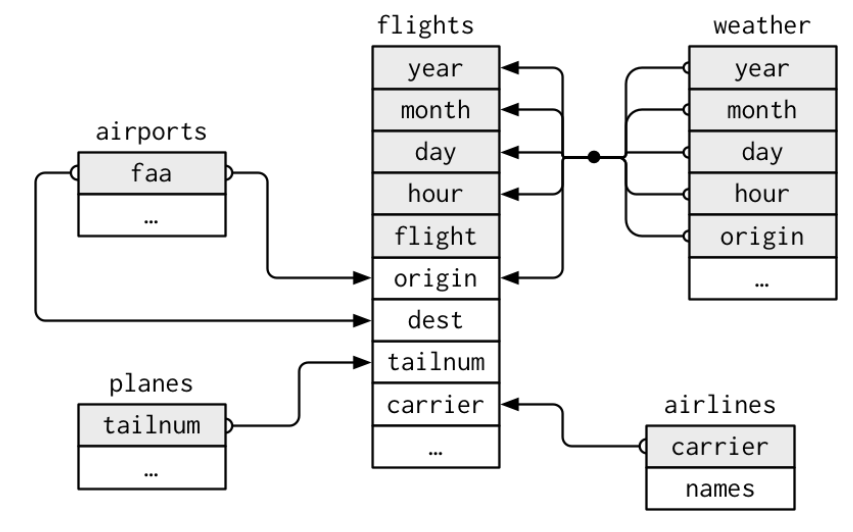

# Setup

First, we load the tidyverse package.
```{r message=FALSE, warning=FALSE}
library(tidyverse)
```

Then, we need to install the package `nycflights13`. The package contains the following five datasets: _airlines_, _airports_, _planes_, _weather_, and _flights_. For explanations on the data use `help(airlines)`, `help(airports)`, etc. To make the data visible in the global environment we need to assign them to some variable.

```{r}
if (!("nycflights13" %in% installed.packages()[,1])) {
  install.packages("nycflights13")
}
```

```{r}
airlines <- nycflights13::airlines 
airports <- nycflights13::airports
planes <- nycflights13::planes
weather <- nycflights13::weather
flights <- nycflights13::flights
```

# Analyse data
```{r}
inspect <- function(object){
  # Print hte dimensions of the current object
  dimensions <- paste0(dim(object), collapse="-by-")
  print(paste0("Object has dimensions(rows-by-columns) of: ", dimensions))
  
  # Get the name and the mode (i.e. data type) of each column
  name_mode = c(Column=NA, Mode=NA)

  for (name in names(object)){
    # Extract the corresponding column
    # object[[name]] is used to obtain a vector and avoid preservation of the structure.
    curr_column <- object[[name]]
    # append the new pair of name and mode at the end of `name_mode`
    name_mode <- bind_rows(name_mode, 
                           c(Column=name, 
                             Mode=mode(curr_column)))
  }
  name_mode[-1,]
}
```
## Airlines
- Inspect the airlines data and print the first 5 rows.
```{r}
airlines %>% inspect()

```

## Airports 
- Inspect the airports data and print the first rows.
```{r}
airports %>% inspect()
```
- The variabe `alt` represents the airport's altitude in feet. Replace `alt` by the corresponding altitude in meters (meter = feet * 3.28084). Then filter for the 5 airports with the highest altitude
- Filter for all airports which are located at an altitude lower than sea level

## Weather
- Inspect the data and print the first rows. 
- Does the data only cover New York or also the weather at destination airports? 
- Change the units to European standards:  
  * Temperature (`temp`) and dew point (`dewp`): Celsius = (Fahrenheit - 32) * 5 / 9 
  * Visibility (`visib`): kilometer = miles / 1.60934
  * Wind speed (`wind_speed`): kilometer/hour = (miles/hour) /1.60934
  * Precipitation (`precip`): millimeter = inches * 20.54
- What was the 2013 average of `temp`, `wind_speed`, and `visib` at the JFK airport?
- What was the *monthly* average of `temp`, `wind_speed`, and `visib` at the JFK airport?
- What was the minimum `temp`, the maximum `temp`, and the total amount of `precip` at each of the 3 airports in December 2013? 

## Planes
- Inspect the planes data and print the first 5 rows.
- Count the numer of planes per `manufacturer` and sort in descending order? 
- Calculate per manufacturer: 1. number of planes, 2. average number of `seats`, 3. average number of `engines`, 4. average `year` when the planes where manufactured. And again order in descending order of the number of planes

## Flights
- Inspect the flights data and print the first 5 rows.
- Count the total number of flights and the average delay during the whole year per `hour` of departure.
- Count the number of flights by destionation airport (`dest`) and arrange them in descending order.

# Join datasets 
Join the five data sets into one large data set. To better understand the relationship between them, study the file _img/table_realtionships.PNG_ (or alternatively knit this Rmd file.) 

{width=70%}


# Freely explore
Some questions for inspiration:

- Do smaller planes (as measured by the number of seats) have less departure delay?
- What is the average flight distance and the average delay by airline
- What's the average delay by airline? (But note that this will be strongly correlated with flight distance, 
- Is bad weather (precipitation, low visibility, low temperatures) related to departure delay? 
